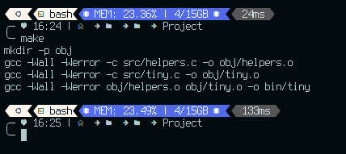
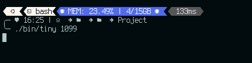
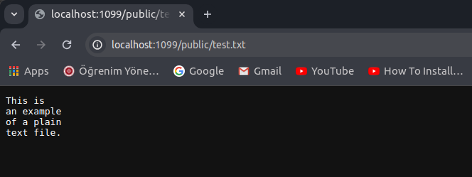
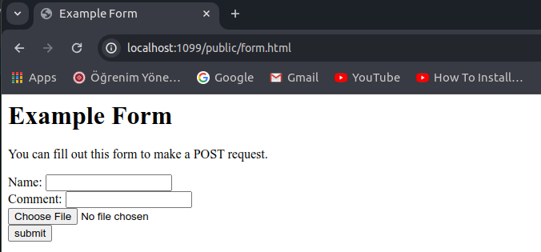
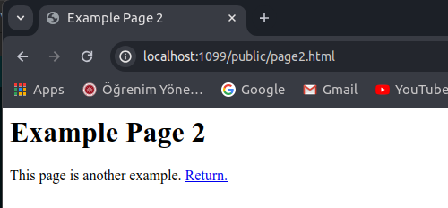
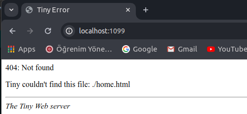

# Small web server called tiny

tiny is a small web server that supports `GET requests` made from any web browser of your choice via http protocol (beware https does not work!! because I haven't implemented openSSL functionality) following are the commands to build and run the web server:

## Folder Structure of Project

- bin
  - tiny
- obj
  - helpers.o
  - tiny.o
- public
  - form.html
  - index.html
  - page2.html
  - smile.png
  - test.txt
- src
  - helpers.h
  - helpers.c
  - tiny.c
- Makefile
- README.md

## Building the Server

run the `make` command from the top-level directory (PROJECT directory) as follows:

```shell
    make
```

running make command will create object files under the `obj` directory. As an output of running make command you should see output on your terminal similar to following if program was buid successfully:

```shell
    mkdir -p obj
    gcc -Wall -Werror -c src/helpers.c -o obj/helpers.o
    gcc -Wall -Werror -c src/tiny.c -o obj/tiny.o
    gcc -Wall -Werror obj/helpers.o obj/tiny.o -o bin/tiny
```

Final step is runnig our tiny web server via following command:

command must be in the form `<path_to_tiny_executable> <port_number>`

```shell
    ./bin/tiny 1095 
```

If all the above steps are successfully done, you can go to your favorite web browser and type the URL in the following format to access our local web server:

```shell
    http://localhost:<port_number>/public/<any_file_to_be-served>
```

when making http request our web server tiny, you shuld provide a path to any file that you want to get located under the public directory, available files are as follows:

- public
  - form.html
  - index.html
  - page2.html
  - smile.png
  - test.txt

## Cleaning up the Project directory

run the following command from the top-level directory (which is PROJECT) to clean up the project directory, so that you can later rebuild the project:

```shell
    make clean
```

You can find the steps to be followed in image format as follows:













We can also see log messages of our web server tiny on terminal when we make a GET request to valid file, for example for test.txt file log is as follows:


